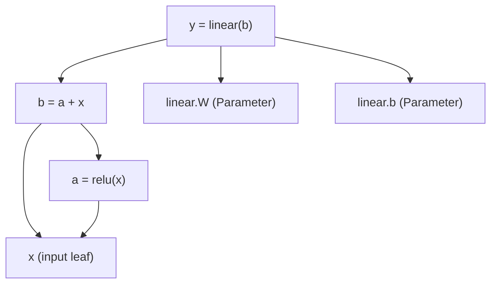

# How `autocov` works — the graph is built child → parent

We use one small network throughout:

```python
a = relu(x)          # a.parents = (x,)
b = a + x            # b.parents = (a, x)   ← x reused: the residual skip
y = linear(b)        # y.parents = (b, linear.W, linear.b)
```

---

## 1. Create the network

A network is a `Module`; you write `forward`, nothing else:

```python
from triton_tagi.autocov import Linear, Module, relu, tensor

class ResidualNet(Module):
    def __init__(self, n_in, n_out):
        super().__init__()
        self.linear = Linear(n_in, n_out)   # the only learnable layer

    def forward(self, x):                   # x : GaussianTensor
        a = relu(x)                         # Activation op
        b = a + x                           # Add op — the residual "+ x" skip
        return self.linear(b)               # Linear op

net = ResidualNet(n_in, n_out)
y = net(tensor(x_sample, var=0.0))          # forward records the graph
y.observe(target, var_v=0.1)                # walks it backward → updates net's params
```

---

## 2. GaussianTensor, A node remembers its parents

A `GaussianTensor` carries its moments *and* the links needed to walk the graph:

```python
class GaussianTensor:
    mu, var        # this value's moments
    parents        # the nodes this value was computed FROM   (child → parent edges)
    _op            # the Operation that produced it            (knows how to push back)
    d_mu, d_var    # the innovation accumulated here           (like autograd's .grad)
```
---

## 3. Operations on GaussianTensor-> return: `GaussianTensor`
- Add: x + y  
- Mul (element-wise): x .* y
- Linear
- Activation: relu, tanh, sigmoid, ...
- conv2d, lstm, ...

So as `forward` executes line by line, each op hands back a new child already
wired to its parents — the graph assembles itself:

```python
a = relu(x)          # a.parents = (x,)
b = a + x            # b.parents = (a, x)          ← x reused: the residual skip
y = self.linear(b)   # y.parents = (b, linear.W, linear.b)
```

That gives this DAG (**arrows point child → parent**, the direction the links are
stored and the update travels):

## 4. Build automatic graph for backward



Notice `x` is a parent of **both** `a = relu(x)` and `b = a + x`. Nobody wrote
"skip connection" logic — `x` simply appears twice in a `parents` list, so it has
two children. That single fact is what makes this a residual block.

```
y ──▶ b ──▶ a ──▶ x        (main path)
 │     └────────▶ x        (skip: b also pushes to x)
 └──▶ linear.W, linear.b   (update)

```
## 5 . Operation class, backward: child → parent

The only place edges are created is inside an **`Operation`**. Its `forward`
computes the output moments and builds the child node, **recording its parents**:

```python
class Operation:
    def forward(self, *inputs) -> GaussianTensor:
        # ... compute mu/var of the result ...
        return GaussianTensor(mu, var, parents=inputs, op=self)   # ← links child→parents
    def backward(self, node): ...   # push node's innovation up to node.parents (delta_mu, delta_var for parents)
```

```
1. `y` (child) pushes innovation to its parents `b`(delta_mu, delta_var), `linear.W`(delta_mu, delta_var), `linear.b` (delta_mu, delta_var).
2. `linear.W`, `linear.b` have received everything → apply their update for parameters.
3. `b` pushes to **both** parents `a`(delta_mu_a, delta_var_a). and `x`(delta_mu_x_1, delta_var_x_1).
4. `a` pushes to `x`(delta_mu_x_2, delta_var_x_2).
5. `x` has now summed **two** contributions — from the main path (`x→a→b`) and the
   skip (`x→b`) — because `_accumulate` adds each child's push. It's a leaf, so the
   walk stops.
```

## 6. Re-use existing layers implementation.
new:
- Add: x + y  
- Mul (element-wise): x .* y

can be re-used:
- Activation: relu, tanh, sigmoid, ...
    z2 = act(z1); 
    (mean_z2, var_z2, jcb) = forward(); 
    delta_mu_z1, delta_var_z1 = backward()
    delta_mu_z1 = jcb * delta_mu_z2
    delta_var_z1 = jcb * jcb * delta_var_z2

- Linear: 
    z2 = linear(z1); 
    (mean_z2, var_z2) = forward(); 
    (delta_mu_z1, delta_var_z1), (delta_mu_w/b, delta_var_w/b) = backward()

- conv2d, lstm, ...
    z2 = conv2d(z1); 
    (mean_z2, var_z2) = forward(); 
    (delta_mu_z1, delta_var_z1), (delta_mu_w/b, delta_var_w/b) = backward()

